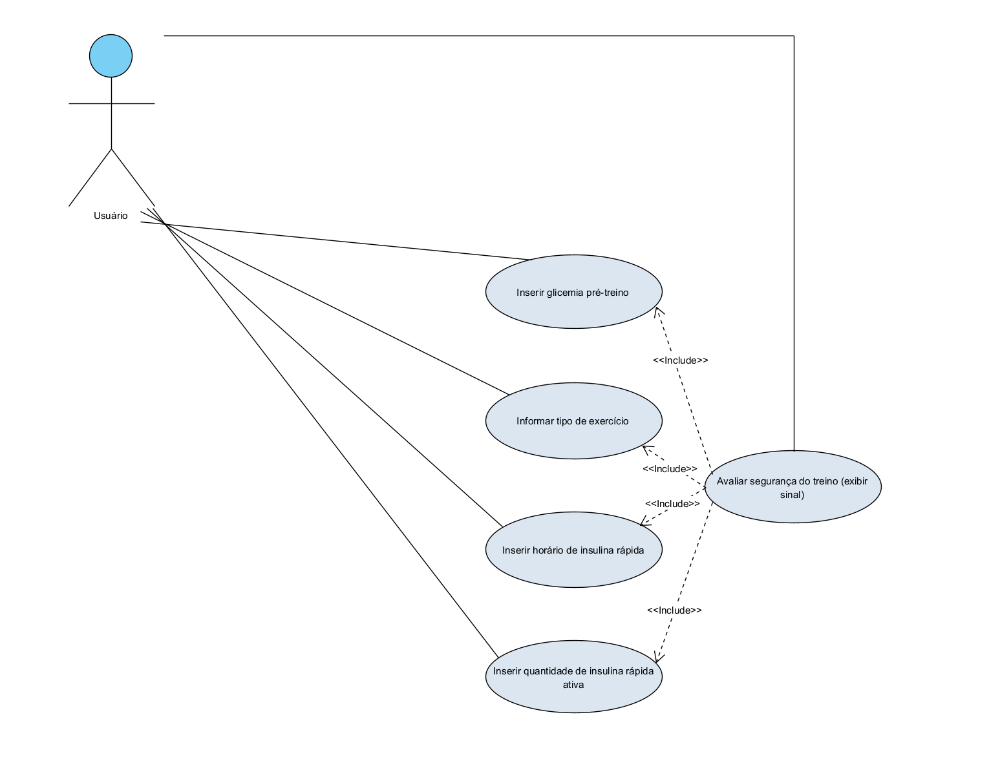
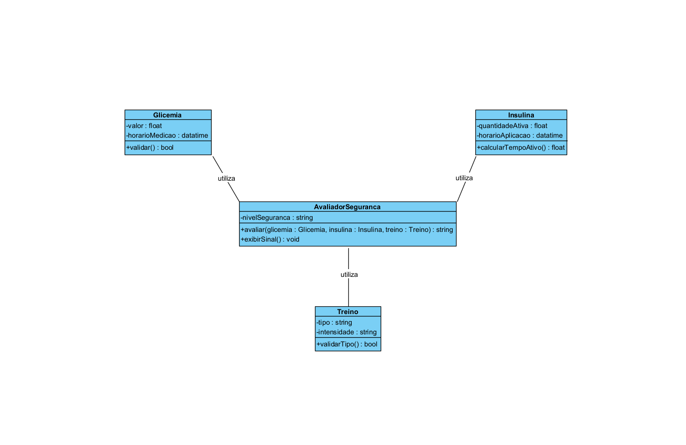

# DiabetesFit – Definição de Requisitos e Modelagem

## Visão Geral
O **DiabetesFit** é um aplicativo web simples que coleta informações do usuário sobre:
- Glicemia pré-exercício  
- Tipo de exercício  
- Quantidade de insulina rápida ativa  

Com base nesses dados, o sistema devolve um **sinal (verde, laranja ou vermelho)** indicando se é seguro iniciar o treino.

O projeto é voltado para **educação e prototipagem funcional**, sem armazenamento de dados nem autenticação de usuários.  
O comportamento é semelhante ao de uma **calculadora inteligente de segurança glicêmica**.

---

## Requisitos Funcionais (RF)

| Código | Descrição | Prioridade |
|--------|------------|-------------|
| **RF01** | Inserir glicemia pré-exercício. O usuário deve informar manualmente sua glicemia antes do treino. | Obrigatório |
| **RF02** | Informar tipo de exercício. O usuário deve selecionar entre opções pré-definidas (ex: musculação, corrida, natação). | Obrigatório |
| **RF03** | Inserir o horário de aplicação da insulina rápida. | Obrigatório |
| **RF04** | Inserir quantidade de insulina rápida ativa no corpo. | Obrigatório |
| **RF05** | Exibir resultado em cores (verde, laranja ou vermelho) após o cálculo. | Obrigatório |

🟢 **Verde:** seguro para treinar  
🟠 **Laranja:** atenção, possível risco  
🔴 **Vermelho:** não recomendado iniciar o treino  

---

## Requisitos Não Funcionais (RNF)

| Código | Descrição |
|--------|------------|
| **RNF01** | Compatibilidade com navegadores modernos (Chrome, Firefox, Edge). |
| **RNF02** | Interface simples e responsiva, adaptada para celular e desktop. |
| **RNF03** | Não deve salvar dados ou informações do usuário (sem persistência). |

---

## Próximas Etapas de Desenvolvimento

1. Validar os requisitos funcionais e não funcionais.  
2. Criar os **diagramas UML** (caso de uso e classes).  
3. Desenvolver um **protótipo de interface em HTML/CSS**.  
4. Implementar as **regras de negócio em JavaScript**.  
5. Realizar **testes manuais** de fluxo.  

---

## Diagrama de Caso de Uso (UML)

O diagrama abaixo representa as interações principais do usuário com o sistema **DiabetesFit** e as dependências funcionais entre os casos de uso.

### Descrição
- **Ator:** Usuário (pessoa com diabetes que deseja verificar a segurança para iniciar o treino)
- **Casos de uso principais:**
  - Inserir glicemia pré-treino  
  - Informar tipo de exercício  
  - Inserir horário da insulina rápida  
  - Inserir quantidade de insulina rápida ativa  
- **Caso de uso central:** Avaliar segurança do treino (exibir sinal verde, laranja ou vermelho)
- **Relacionamentos:**  
  - O caso “Avaliar segurança do treino” **inclui** todos os quatro casos anteriores, pois depende dessas informações para processar o resultado.

---

## Diagrama de Classes (UML)

O diagrama abaixo representa a estrutura lógica do sistema, mostrando as principais classes, atributos, métodos e seus relacionamentos.

### Descrição das Classes

#### **Glicemia**
Representa os dados de glicemia coletados antes do treino.

- **Atributos:**
  - `valor: float` → valor atual da glicemia informado pelo usuário.  
  - `horarioMedicao: datetime` → horário em que a glicemia foi medida.

- **Métodos:**
  - `validar(): bool` → verifica se o valor informado está dentro de um intervalo aceitável.

---

#### **Insulina**
Representa as informações sobre a insulina rápida ativa no corpo.

- **Atributos:**
  - `quantidadeAtiva: float` → quantidade de insulina rápida ativa.  
  - `horarioAplicacao: datetime` → horário da última aplicação de insulina.

- **Métodos:**
  - `calcularTempoAtivo(): float` → calcula o tempo decorrido desde a aplicação.

---

#### **Treino**
Contém as informações sobre o exercício físico que será realizado.

- **Atributos:**
  - `tipo: string` → tipo de treino (musculação, corrida, natação, etc).  
  - `intensidade: string` → nível de intensidade (leve, moderado, intenso).

- **Métodos:**
  - `validarTipo(): bool` → valida se o tipo e intensidade são válidos.

---

#### **AvaliadorSeguranca**
Classe principal responsável por avaliar se é seguro iniciar o treino.

- **Atributos:**
  - `nivelSeguranca: string` → sinal gerado após a avaliação (verde, laranja ou vermelho).

- **Métodos:**
  - `avaliar(glicemia: Glicemia, insulina: Insulina, treino: Treino): string`  
    → processa os dados informados e determina o nível de segurança.  
  - `exibirSinal(): void`  
    → exibe o resultado final em forma de cor (verde, laranja ou vermelho).

---

### Relacionamentos
- A classe **AvaliadorSeguranca** *utiliza* as classes **Glicemia**, **Insulina** e **Treino** para processar as informações e calcular o resultado.  
- As demais classes são independentes, mantendo **baixo acoplamento** e **alta coesão**.  
- O modelo segue o paradigma de **orientação a objetos**, mesmo sem banco de dados, permitindo futura expansão para **versão mobile ou backend**.

---

## Versão Atual
**v0.2 – Modelagem concluída (Requisitos + Caso de Uso + Diagrama de Classes)**  
*Próxima etapa:* Prototipagem em HTML/CSS.

---

## Autor
**Talles Alves** – Profissional de Educação Física e estudante de Engenharia de Software  
📧 [GitHub](https://github.com/tallesalves) • [LinkedIn](https://www.linkedin.com/in/tallesalves/)
