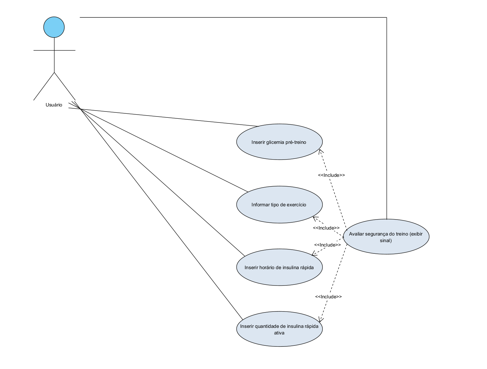
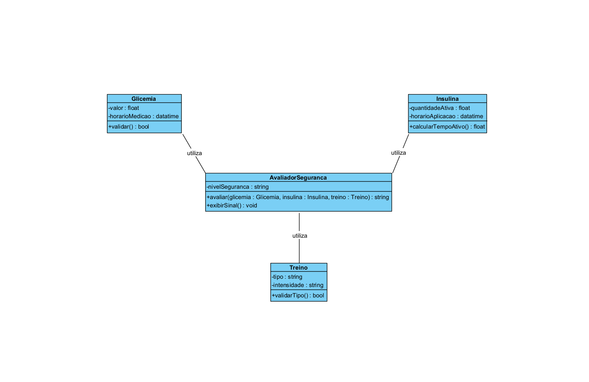
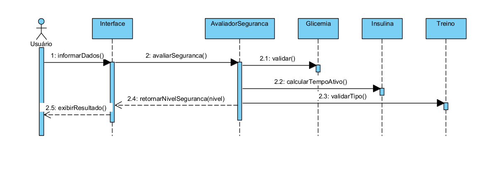
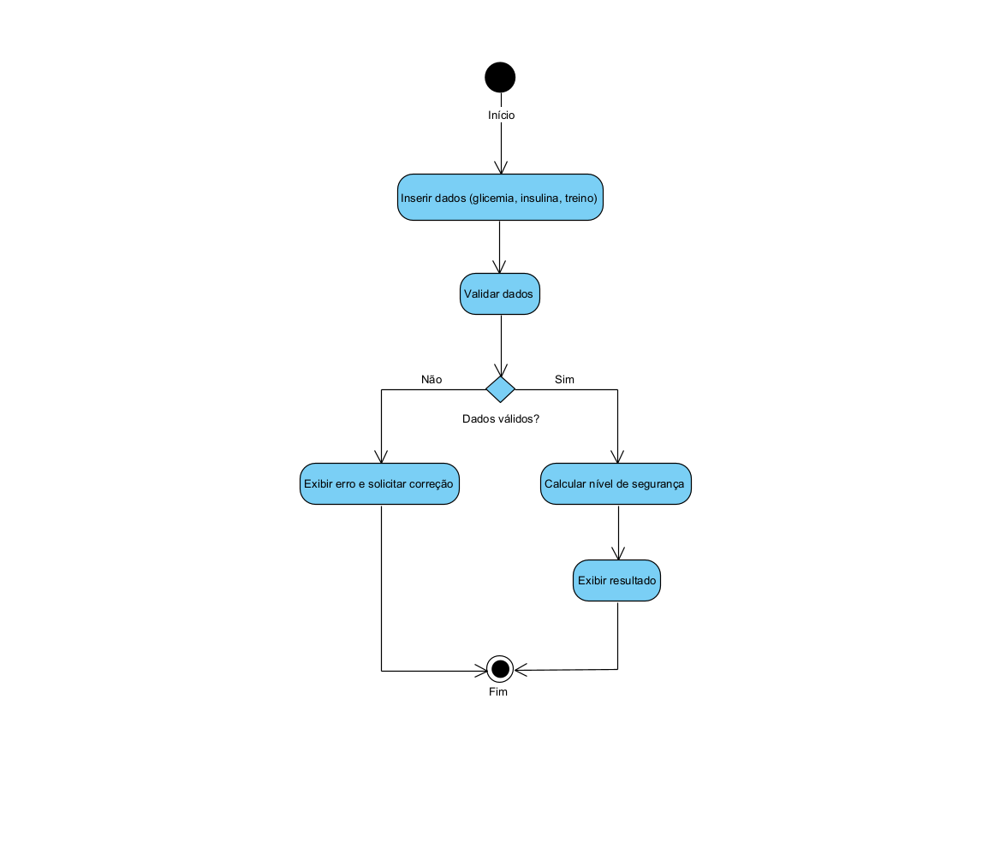
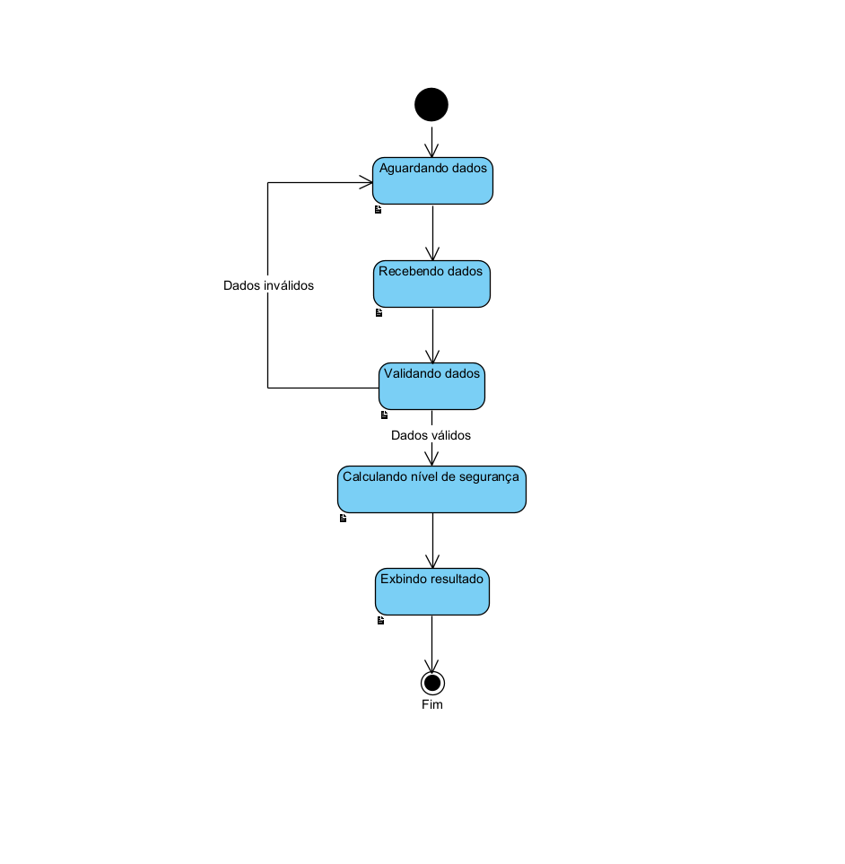

# DiabetesFit – Definição de Requisitos e Modelagem

## Visão Geral
O **DiabetesFit** é um aplicativo web simples que coleta informações do usuário sobre:
- Glicemia pré-exercício  
- Tipo de exercício  
- Quantidade de insulina rápida ativa  

Com base nesses dados, o sistema devolve um **sinal (verde, laranja ou vermelho)** indicando se é seguro iniciar o treino.

O projeto é voltado para **educação e prototipagem funcional**, sem armazenamento de dados nem autenticação de usuários.  
O comportamento é semelhante ao de uma **calculadora inteligente de segurança glicêmica**.

---

## Requisitos Funcionais (RF)

| Código | Descrição | Prioridade |
|--------|------------|-------------|
| **RF01** | Inserir glicemia pré-exercício. O usuário deve informar manualmente sua glicemia antes do treino. | Obrigatório |
| **RF02** | Informar tipo de exercício. O usuário deve selecionar entre opções pré-definidas (ex: musculação, corrida, natação). | Obrigatório |
| **RF03** | Inserir o horário de aplicação da insulina rápida. | Obrigatório |
| **RF04** | Inserir quantidade de insulina rápida ativa no corpo. | Obrigatório |
| **RF05** | Exibir resultado em cores (verde, laranja ou vermelho) após o cálculo. | Obrigatório |

🟢 **Verde:** seguro para treinar  
🟠 **Laranja:** atenção, possível risco  
🔴 **Vermelho:** não recomendado iniciar o treino  

---

## Requisitos Não Funcionais (RNF)

| Código | Descrição |
|--------|------------|
| **RNF01** | Compatibilidade com navegadores modernos (Chrome, Firefox, Edge). |
| **RNF02** | Interface simples e responsiva, adaptada para celular e desktop. |
| **RNF03** | Não deve salvar dados ou informações do usuário (sem persistência). |

---

## Próximas Etapas de Desenvolvimento

1. Validar os requisitos funcionais e não funcionais.  
2. Criar os **diagramas UML** (caso de uso, classes, sequência, atividades e estados).  
3. Desenvolver um **protótipo de interface em HTML/CSS**.  
4. Implementar as **regras de negócio em JavaScript**.  
5. Realizar **testes manuais** de fluxo.  
6. Revisar as **regras de negócio**. 
7. Evoluir o **design e o feedback visual** do resultado.

---

## Estrutura da Implementação
O projeto agora utiliza **JavaScript moderno com ES Modules**, seguindo boas práticas de separação de responsabilidades.
frontend/
│
├── index.html                → Interface e inclusão dos scripts via type="module"
├── style.css                 → Estilização geral
├── main.js                   → Arquivo principal que orquestra o fluxo
│
└── modules/
    ├── format.js             → Normalização de valores (números e horário)
    ├── validators.js         → Validação das entradas do usuário
    ├── evaluator.js          → Regras de avaliação de segurança
    └── ui.js                 → Funções para exibição no DOM

---

## Diagrama de Caso de Uso (UML)

O diagrama abaixo representa as interações principais do usuário com o sistema **DiabetesFit** e as dependências funcionais entre os casos de uso.

### Descrição
- **Ator:** Usuário (pessoa com diabetes que deseja verificar a segurança para iniciar o treino)
- **Casos de uso principais:**
  - Inserir glicemia pré-treino  
  - Informar tipo de exercício  
  - Inserir horário da insulina rápida  
  - Inserir quantidade de insulina rápida ativa  
- **Caso de uso central:** Avaliar segurança do treino (exibir sinal verde, laranja ou vermelho)
- **Relacionamentos:**  
  - O caso “Avaliar segurança do treino” **inclui** todos os quatro casos anteriores, pois depende dessas informações para processar o resultado.

---

## Diagrama de Classes (UML)

O diagrama abaixo representa a estrutura lógica do sistema, mostrando as principais classes, atributos, métodos e seus relacionamentos.

### Descrição das Classes

#### **Glicemia**
Representa os dados de glicemia coletados antes do treino.

- **Atributos:**
  - `valor: float` → valor atual da glicemia informado pelo usuário.  
  - `horarioMedicao: datetime` → horário em que a glicemia foi medida.

- **Métodos:**
  - `validar(): bool` → verifica se o valor informado está dentro de um intervalo aceitável.

---

#### **Insulina**
Representa as informações sobre a insulina rápida ativa no corpo.

- **Atributos:**
  - `quantidadeAtiva: float` → quantidade de insulina rápida ativa.  
  - `horarioAplicacao: datetime` → horário da última aplicação de insulina.

- **Métodos:**
  - `calcularTempoAtivo(): float` → calcula o tempo decorrido desde a aplicação.

---

#### **Treino**
Contém as informações sobre o exercício físico que será realizado.

- **Atributos:**
  - `tipo: string` → tipo de treino (musculação, corrida, natação, etc).  
  - `intensidade: string` → nível de intensidade (leve, moderado, intenso).

- **Métodos:**
  - `validarTipo(): bool` → valida se o tipo e intensidade são válidos.

---

#### **AvaliadorSeguranca**
Classe principal responsável por avaliar se é seguro iniciar o treino.

- **Atributos:**
  - `nivelSeguranca: string` → sinal gerado após a avaliação (verde, laranja ou vermelho).

- **Métodos:**
  - `avaliar(glicemia: Glicemia, insulina: Insulina, treino: Treino): string`  
    → processa os dados informados e determina o nível de segurança.  
  - `exibirSinal(): void`  
    → exibe o resultado final em forma de cor (verde, laranja ou vermelho).

---

### Relacionamentos
- A classe **AvaliadorSeguranca** *utiliza* as classes **Glicemia**, **Insulina** e **Treino** para processar as informações e calcular o resultado.  
- As demais classes são independentes, mantendo **baixo acoplamento** e **alta coesão**.  
- O modelo segue o paradigma de **orientação a objetos**, mesmo sem banco de dados, permitindo futura expansão para **versão mobile ou backend**.

---

## Diagrama de Sequência (UML)

Representa a ordem de interação entre os objetos durante a execução do caso de uso “Avaliar Segurança do Treino”.

### Descrição
1. O **Usuário** informa os dados na **Interface**.  
2. A Interface envia os dados ao **AvaliadorSeguranca**.  
3. O Avaliador chama métodos de **Glicemia**, **Insulina** e **Treino** para validar as entradas.  
4. O Avaliador processa e retorna o nível de segurança (verde, laranja ou vermelho).  
5. A Interface exibe o resultado ao Usuário.

---

## Diagrama de Atividades (UML)

Representa o fluxo de execução do processo de avaliação, incluindo as decisões condicionais e ações do sistema.

### Fluxo
1. Início  
2. Inserir dados (glicemia, insulina, treino)  
3. Validar dados  
4. Decisão: Dados válidos?  
   - ❌ Não → Exibir erro e solicitar correção  
   - ✅ Sim → Calcular nível de segurança  
5. Exibir resultado  
6. Fim  

---

## Diagrama de Estados (UML)

Representa os estados possíveis do objeto **AvaliadorSeguranca** e as transições entre eles ao longo do processo.

### Estados Principais
- **Aguardando dados:** sistema inicializa e espera entrada do usuário.  
- **Recebendo dados:** dados sendo inseridos.  
- **Validando dados:** verifica consistência e intervalo de valores.  
- **Calculando nível de segurança:** aplica regras de avaliação.  
- **Exibindo resultado:** apresenta o sinal visual ao usuário.  

### Transições
- [dados válidos] → Calculando nível de segurança  
- [dados inválidos] → Retorna para Aguardando dados  

---

## Regras de Negócio (Em Refinamento)

Esta seção descreve as regras utilizadas pelo sistema para classificar o nível de segurança do treino.

⚠️ **Importante:**  
As regras abaixo ainda estão em processo de refinamento e validação clínica.  
Podem sofrer ajustes conforme novos cenários são analisados.

---

### 🔴 Regras de Nível Vermelho (Alto Risco)

O sistema classifica como **vermelho (não iniciar o treino)** quando ocorre qualquer uma das condições abaixo:

- Glicemia **abaixo de 70 mg/dL**
- Glicemia **acima de 180 mg/dL**, exceto:
  - Quando o exercício é aeróbico  
  - E existe insulina ativa recente (≤ 120 minutos)
- Insulina ativa **acima de 5U aplicada há menos de 2 horas**

---

### 🟠 Regras de Nível Laranja (Atenção)

O sistema classifica como **laranja (atenção)** quando há risco moderado, incluindo:

- Glicemia entre **70 e 85 mg/dL** em exercícios aeróbicos  
- Glicemia abaixo de **100 mg/dL com insulina recente** em exercícios aeróbicos  
- Insulina aplicada **muito recentemente (≤ 15 minutos)** em exercícios aeróbicos com glicemia < 100  
- Glicemia entre **70 e 100 mg/dL com insulina ativa elevada (>3U)** aplicada recentemente  

---

### 🟢 Regra de Nível Verde (Seguro)

O sistema classifica como **verde (treino liberado)** quando:

- Nenhuma das condições de risco (vermelho ou laranja) é atendida

---

### 📌 Observações Importantes

- O sistema utiliza uma abordagem baseada em **prioridade de risco**:
  - 🔴 Vermelho → prioridade máxima  
  - 🟠 Laranja → risco intermediário  
  - 🟢 Verde → ausência de risco detectado  

- As regras são aplicadas em ordem hierárquica:
  1. Verificação de regras vermelhas  
  2. Verificação de regras laranjas  
  3. Caso nenhuma seja atendida → resultado verde  

- A classificação do tipo de exercício (aeróbico ou não) influencia diretamente a avaliação.

---

## Versão Atual
**v0.4 – Início da Implementação (HTML/CSS concluídos + JS modular iniciado)**
*Próxima etapa:* Finalizar a lógica de negócio no JavaScript e integrar avaliação + exibição.

---

## Autor
**Talles Alves** – Profissional de Educação Física e estudante de Engenharia de Software  
📧 [GitHub](https://github.com/tallesalves) • [LinkedIn](https://www.linkedin.com/in/tallesalves/)